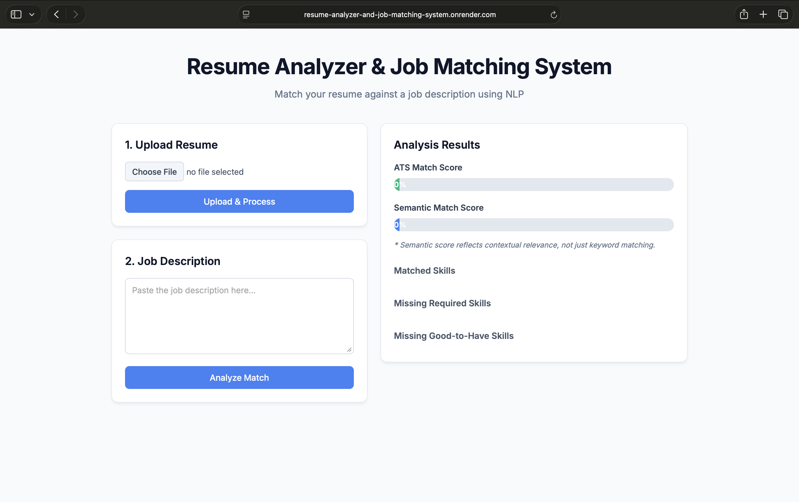
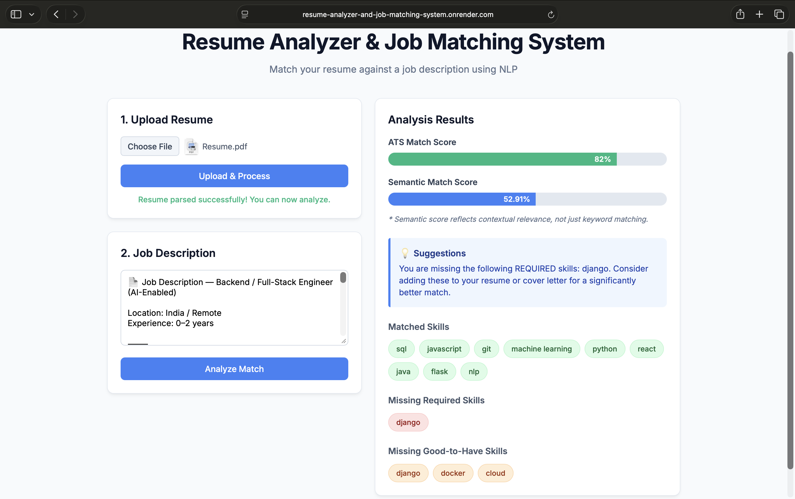

# Resume Analyzer & Job Matching System

A full-stack web application that evaluates how well a resume matches a job description using both ATS-style keyword matching and semantic similarity.

🔗 Live Demo: https://resume-analyzer-and-job-matching-system.onrender.com

---

## 🚀 Features

- Resume PDF parsing and text extraction
- Skill extraction and normalization
- Weighted ATS scoring (required vs good-to-have skills)
- Semantic similarity for contextual relevance
- Skill gap identification with suggestions
- Clean and interactive UI with dual score display

---

## 🧠 How It Works

1. **Resume Upload**
   - Extract text from PDF using `pdfplumber`
   - Identify and normalize technical skills

2. **Job Description Parsing**
   - Categorize skills into:
     - Required
     - Good-to-have

3. **Scoring**
   - **ATS Score:** Rule-based matching with weighted importance
   - **Semantic Score:** Measures contextual similarity between resume and job description

4. **Output**
   - Matched skills
   - Missing required skills
   - Missing optional skills
   - Suggestions for improvement

---

## 🛠 Tech Stack

- **Backend:** Flask (Python)
- **Frontend:** HTML, CSS, JavaScript
- **NLP:** sentence-transformers
- **PDF Parsing:** pdfplumber
- **Deployment:** Render

---

## 📊 Example Output

ATS Match Score: 73%
Semantic Match Score: 50%

Missing Skills:
	•	Django
	•	NLP

> Semantic score reflects contextual relevance, not just keyword matching.

---

## 📸 Screenshots

### Home Interface


### Match Analysis Result


---

## ▶️ Local Setup

```bash
git clone https://github.com/aryan00719/resume-analyzer-job-matcher.git
cd resume-analyzer-job-matcher

python3 -m venv venv
source venv/bin/activate

pip install -r requirements.txt
python app.py
```

Open: http://127.0.0.1:5000

⸻

🔮 Future Improvements
	•	Resume improvement suggestions
	•	Job scraping integration
	•	Enhanced skill extraction using advanced NLP
	•	Performance optimization for large resumes

⸻

👨‍💻 Author

Aryan Mishra
Computer Science Undergraduate
Interested in Backend Development, NLP, and Full-Stack Systems